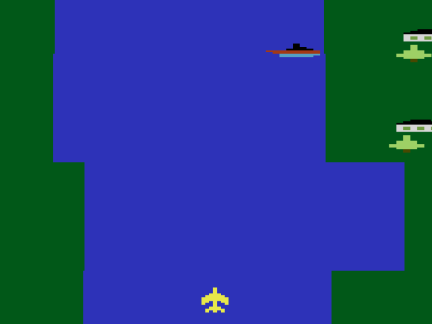

# River Raid - A Phaser Web Game

Welcome to River Raid, a web-based 2D game inspired by the classic Atari game of the same name. In this game, players control a plane as it navigates through enemy territory, avoiding obstacles, and shooting down enemies. The game uses keyboard arrow keys and the Spacebar for controlling the plane’s movements and firing bullets.

## Game Features

- **Dynamic gameplay**: The player controls a plane using the **arrow keys** and fires bullets with the **spacebar**.
- **Randomized elements**: Instead of manually designing the scenes and placing elements, I used randomization to position characters and objects. This approach allowed me to focus more on coding and the game's logic while making the game feel dynamic and varied with each playthrough.
- **Multiple enemies**: Helicopters, battleships, and other enemies move across the screen, providing a challenging experience.
- **Sound effects**: Includes sound effects for explosions, engine sounds, and more.
- **Responsive controls**: Players can control the speed of their plane, adjust their movement direction, and fire bullets.

## New Features Added

This game has been enhanced with the following features:

- **Scoreboard**: A live scoreboard is now displayed during the game to track your current score in real time.
- **LocalStorage Integration for High Scores**: The highest score achieved is saved locally in the browser using LocalStorage, so you can challenge yourself to beat your previous best.
- **Life Information**: The player’s remaining lives are now displayed on the screen, making it easier to track how many chances you have left.
- **New Enemy Types**: Additional enemy units have been introduced to add variety and challenge to the gameplay.
- **Dynamic Difficulty**: The game becomes progressively harder as the player’s score increases, ensuring a consistent level of challenge.
- **Touch Gesture Controls**: The game is now compatible with touch devices, allowing players to control the plane using gestures for a more intuitive experience on mobile.

These features elevate the gameplay experience, making it more engaging, challenging, and accessible across various devices.

### Versions

This template has been updated for:

- [Phaser 3.87.0](https://github.com/phaserjs/phaser)
- [Vite 5.3.1](https://github.com/vitejs/vite)
- [TypeScript 5.4.5](https://github.com/microsoft/TypeScript)

## Requirements

[Node.js](https://nodejs.org) is required to install dependencies and run scripts via `npm`.

## Available Commands

| Command | Description |
|---------|-------------|
| `npm install` | Install project dependencies |
| `npm run dev` | Launch a development web server |
| `npm run build` | Create a production build in the `dist` folder |
| `npm run dev-nolog` | Launch a development web server without sending anonymous data (see "About log.js" below) |
| `npm run build-nolog` | Create a production build in the `dist` folder without sending anonymous data (see "About log.js" below) |

## Writing Code

After cloning the repo, run `npm install` from your project directory. Then, you can start the local development server by running `npm run dev`.

The local development server runs on `http://localhost:8080` by default. Please see the Vite documentation if you wish to change this, or add SSL support.

Once the server is running you can edit any of the files in the `src` folder. Vite will automatically recompile your code and then reload the browser.

## Template Project Structure

We have provided a default project structure to get you started. This is as follows:

- `index.html` - A basic HTML page to contain the game.
- `src` - Contains the game source code.
- `src/main.ts` - The main **entry** point. This contains the game configuration and starts the game.
- `src/vite-env.d.ts` - Global TypeScript declarations, provide types information.
- `src/scenes/` - The Phaser Scenes are in this folder.
- `public/style.css` - Some simple CSS rules to help with page layout.
- `public/assets` - Contains the static assets used by the game.

## Deploying to Production

After you run the `npm run build` command, your code will be built into a single bundle and saved to the `dist` folder, along with any other assets your project imported, or stored in the public assets folder.

In order to deploy your game, you will need to upload *all* of the contents of the `dist` folder to a public facing web server.

## Assets Used
For the creation of this game, I have used the following assets under their respective licenses: 
**Jingle_Win_00.wav** by [LittleRobotSoundFactory](https://freesound.org/s/270333/) – License: Attribution 4.0 
**Video Game Music (LOOP)** by [Ric34](https://freesound.org/s/776502/) – License: Attribution 4.0 
**Sound effects** from [Zapsplat.com](https://www.zapsplat.com/) 
**Sprites and Artwork** from The [Spriters Resource](https://www.spriters-resource.com/atari/riverraid/sheet/4176/) 
**Character Sounds** from [masoudhassani/river_raid](https://github.com/masoudhassani/river_raid) GitHub Repository

## Acknowledgments
Special thanks to the creators of the sound effects and sprite sheets used in the game. 
Thanks to **Phaser framework** for making game development easy and fun! 
And a big thank you to **Carol Shaw**, the creator of the original **River Raid** game, who created a timeless classic and sparked countless memories for players around the world.

## License
This project is licensed under the MIT License - see the LICENSE file for details.

